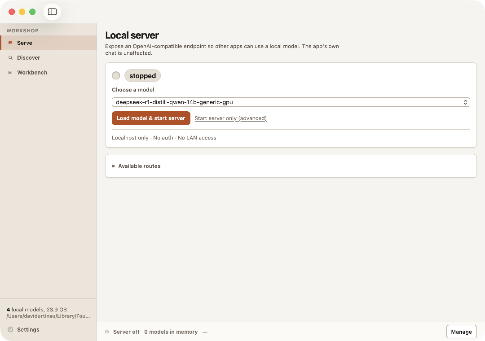
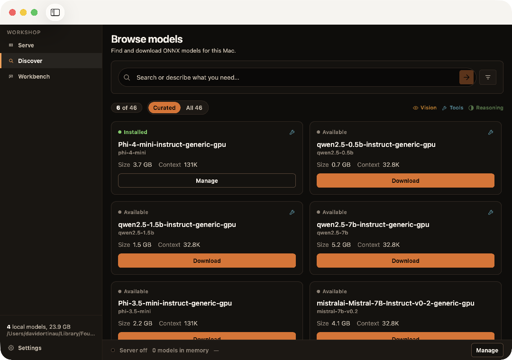
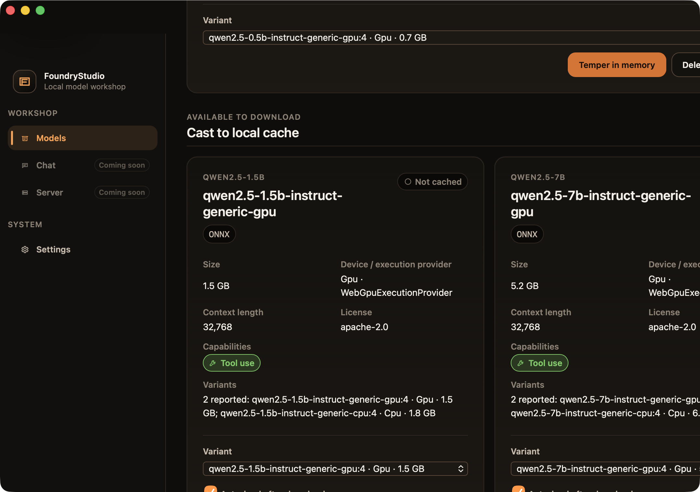
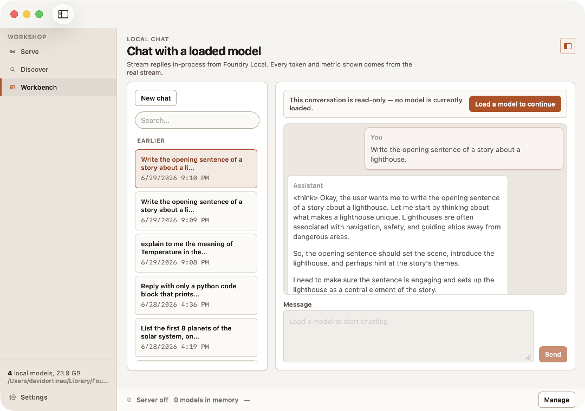
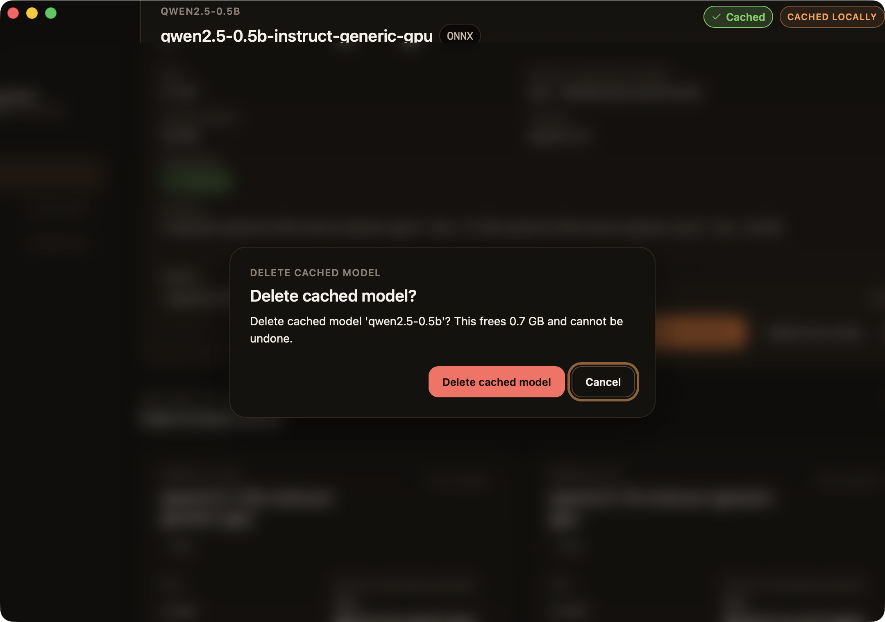
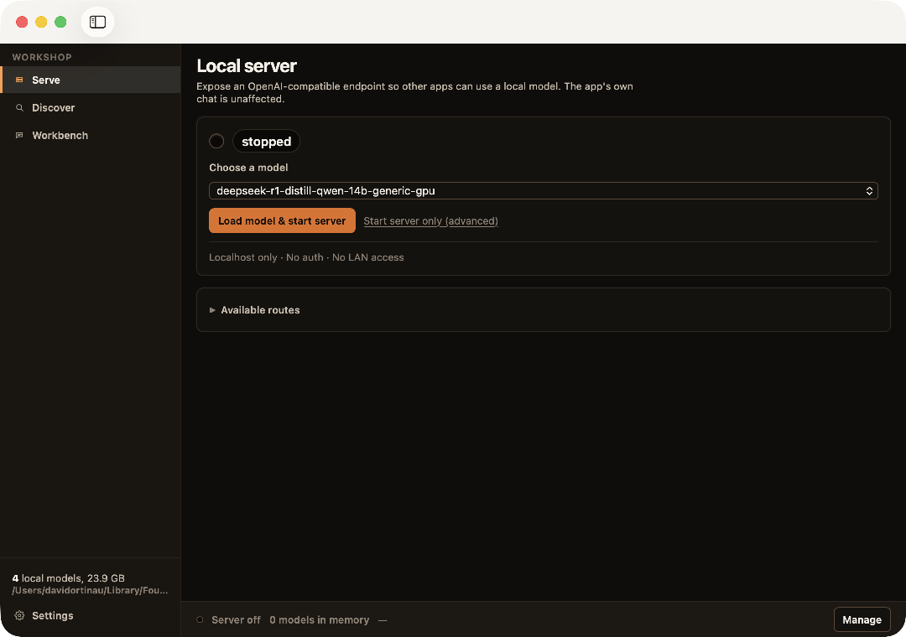

# Build the tools you need

I wanted a clean, native macOS client for running local models, the kind that run on your own machine instead of behind a cloud API. Browse a catalog, download a model, load it, chat with it, and flip on a local server so my other tools could reach it. LM Studio does a version of this for the run-anything crowd. I wanted something that felt native to my Mac and spoke to [Foundry Local](https://learn.microsoft.com/azure/foundry-local/) directly.

It didn't exist. A year ago that's where the story ends, or turns into a feature request I file and wait on. This time I opened a terminal and built it. It's called [FoundryStudio](https://github.com/davidortinau/FoundryStudio), and here's what it looks like today.



That's a real net11 .NET MAUI app with a Blazor Hybrid UI, running on the macOS AppKit head (the native-Mac build target), talking to Foundry Local in-process. I built it with coding assistants over a handful of sessions. This post is about how, because the how is the interesting part now, not the fact that an AI wrote some C#.

## The thing that actually changed

The hype version of this story is "AI writes my code." That's not it. The real shift is who gets to build a tool. Building a native desktop app that loads ONNX models (a portable AI model format) through a chain of native dylibs (the macOS name for a .dll) used to be a project. You need to know MAUI, AppKit signing, Blazor Hybrid, the Foundry Local SDK, and a dozen small platform traps. I know some of that. I don't know all of it, and I didn't want to spend a month relearning the parts I've forgotten.

Coding assistants like GitHub Copilot CLI and Claude Code close that gap. I mean the terminal-based kind that can read your files, run commands, and change a whole project, not the inline autocomplete you may already use. They help, but only if you give them a workflow. Point one at an empty folder and say "build me a local model app" and you get a mess. Give it structure, guardrails, and a way to see its own work, and you get FoundryStudio. The tips below are the difference between those two outcomes.

## Plan before you build (spec-kit)

I don't let the agent start coding on turn one. Every feature runs through [spec-kit](https://github.com/github/spec-kit) first.

```console
/speckit.constitution   # the non-negotiable principles
/speckit.specify        # what this feature is and isn't
/speckit.plan           # how it gets built
/speckit.tasks          # the ordered task list an agent executes
```

The constitution is the part people skip and shouldn't. Mine encodes two rules that shaped the entire app: be honest (never show UI for something the model can't actually do) and preserve data (never destroy a user's model cache without consent). Those aren't decorations. When an agent later wanted to fake a progress bar or ship a one-click delete, the constitution is what said no.

The tip: write the principles down as a file the agent reads on every task. Values you keep in your head don't survive a long autonomous run. Values in `constitution.md` do.

## Give the agent a team, not a genie (Squad)

A single agent doing everything is how you get code that reviews itself and calls it good. I used [Squad](https://github.com/bradygaster/squad) to split the work across specialists with one rule that matters most: the agent that wrote the code cannot approve it.

That reviewer independence caught real bugs. In the streaming chat work, a reviewer found that assistant markdown could smuggle a `javascript:` link into the Blazor WebView, a genuine XSS hole. The author had used `.DisableHtml()` and thought it was covered. It wasn't, and a separate reviewer is the only reason it got fixed before it shipped. In another pass, a specialist quietly introduced a `.Result` blocking call in the page init, exactly the deadlock trap the guardrails warn about. A test caught it because a test existed for that invariant.

The tip: separate the writer from the reviewer, and make the reviewer independence a rule, not a suggestion. Agents are confident. Confidence is not correctness.

## Give it a feedback loop it can see (DevFlow)

Here's the one most people miss. An agent that can't see the running app is guessing. The screenshots in this post are not me reaching for the mouse. The agent captured them from the live app through [MAUI DevFlow](https://github.com/dotnet/maui-labs), which drives the app, reads its logs, and screenshots the actual Blazor UI.

```console
dotnet build -t:Run
maui devflow ui screenshot --output discover.png
maui devflow theme set dark
maui devflow logs --follow
```

That loop, build, run, look, fix, is what turns "it compiles" into "it works." I put a hard gate on it: any change that alters a rendered surface is not done until an agent has looked at it in both themes, clicked every new control, and confirmed nothing is a dead affordance (a control that looks clickable but does nothing). Build success is a prerequisite, not verification.

The tip: your assistant needs eyes. Whether that's DevFlow for a MAUI app, Playwright for a web app, or a screenshot script, wire up a way for the agent to observe the real thing. Feedback beats cleverness.

## Package expertise as skills

The knowledge that makes UI good is reusable, so I stored it as skills the agent loads on demand. FoundryStudio's repo carries a small library of them:

- `ux-first-principles`, `ux-desktop`, `ux-tablet`, `ux-mobile` for layout and interaction rules
- a `design-review` agent that sweeps a screen for principle violations and dead controls
- `reviewer-protocol`, `test-discipline`, `git-workflow`, `secret-handling` for the process

Skills are just markdown with a bit of front matter, symlinked into place so edits take effect immediately. They mean I don't re-explain "desktop layouts must survive a resize" on every task. I write it once and the agent applies it everywhere. The four UX skills turned out to be the most reusable, so I published them on their own in [davidortinau/maui-skills](https://github.com/davidortinau/maui-skills). Install steps are in the resources below.

The tip: when you find yourself giving the same instruction twice, make it a skill. You're teaching, not just prompting.

## Prove the hard part first (M0)

The best decision we made was refusing to build any UI until the scary part worked. Foundry Local ships as native dylibs. On macOS, Mac Catalyst can't load the `osx-arm64` build. AppKit can. If that native chain didn't bundle, sign, and load under net11, the whole app was dead on arrival, and no amount of pretty catalog UI would save it.

So milestone zero was a feasibility gate and nothing else. Prove the toolchain. Prove `FoundryLocalManager` loads in-process on real Apple Silicon, downloads a model, and streams a coherent reply. Only when that was green did we build the shell (M1), the catalog (M2), install and management (M3), streaming chat (M4), and the local server toggle (M5). Several of those milestones the agents built autonomously while I was away, each one landing with tests passing and an independent review attached.

The tip: find the riskiest assumption in your idea and make the agent prove it before you invest in anything downstream. Kill the project early or clear the path. Both are wins.

## The UI decisions we changed our minds on

An app is a pile of small decisions. A few of ours are worth showing because we got them wrong first, then fixed them.

**Organize around jobs, not features.** The first navigation was Models, Chat, Server, the nouns of the system. It tested poorly. Nobody wakes up wanting to manage "models." They want to find something, run it, and use it. So the nav became Discover, Serve, Workbench, and the app now opens on the job you're most likely there to do.



**Say what you mean.** I love a good metaphor, and FoundryStudio has a forge theme running through it: copper accent, an ember that glows when the server is live. Early on the metaphor crept into the controls. Downloading a model was "Cast to local cache." Loading it was "Temper in memory."



That's cute exactly once, and then it's friction. You should not have to decode a button to press it. We wrote a plain-language rule: the words you read to operate the app are plain (Download, Load, Start server), and the forge is ambient flavor only, the copper glow and the material feel, never an operable label. Compare the current Serve and Discover screens. Plain verbs, warm surface.

**Let honesty show.** This is the constitution made visible. The server card tells you exactly what it is and isn't: "Localhost only. No auth. No LAN access," because Foundry Local doesn't do auth or LAN binding and we refuse to pretend it does. Open the Workbench with no model loaded and the conversation is honestly read-only, with one button to fix it.



When Foundry Local's stream doesn't report total token usage, the metric says "unknown" instead of a made-up number. When a model doesn't advertise tool support, there's no tool UI to tease you. Honesty isn't a feature you add. It's a thousand small refusals to fake things.

**Guard destructive actions.** Deleting a multi-gigabyte model is irreversible, so it's never one click. The delete button only opens a dialog, the dialog names the model and the exact space it frees, and focus defaults to Cancel, not to the red button.



**Two themes, full parity.** Workshop Daylight and Night Forge are not a light coat of CSS over one design. They're built from the same 103 design tokens, and every surface is verified in both before it ships. Here's Serve in each.



## It still isn't magic

I want to be clear that this was not push-button. The agents made mistakes, some of them the kind that ship if you're not paying attention. The value wasn't that the AI was always right. It was that the workflow, specs up front, independent review, tests on the invariants that matter, and a feedback loop the agent could see, caught the misses fast enough that momentum never turned into damage.

That's the mental shift. You stop being the person who types every line and become the person who sets the context, the guardrails, and the checks, then keeps a hand on the wheel. The agents do a lot of the driving. You still own where the car goes.

## Why this matters, and how you'll know it's working

The why is simple. The distance between "I wish this tool existed" and "I built the tool" just collapsed. Not to zero, but far enough that it changes what's worth doing yourself instead of waiting on someone else's roadmap. That's real value whether the thing you build is a first-party product or a scratch-your-own-itch utility you never ship to anyone but yourself.

You'll know it's working when you catch yourself building a small tool on a Tuesday night that you'd never have started a year ago, because starting used to cost a week and now it costs an evening.

## Resources

Everything here is public. Grab what's useful.

- **FoundryStudio source:** [github.com/davidortinau/FoundryStudio](https://github.com/davidortinau/FoundryStudio). The full app, plus the plan, the constitution, the design guide, and the decision log that shaped it.
- **The UX skills:** published on their own in [davidortinau/maui-skills](https://github.com/davidortinau/maui-skills), which also carries 37 .NET MAUI and Xamarin skills. You get `ux-first-principles` plus the medium layers `ux-desktop`, `ux-tablet`, and `ux-mobile`. Install them into GitHub Copilot CLI or Claude Code:

  ```console
  /plugin marketplace add davidortinau/maui-skills
  /plugin install maui-skills@maui-skills
  ```

- **The workflow tools:** [spec-kit](https://github.com/github/spec-kit) for planning, [Squad](https://github.com/bradygaster/squad) for the agent team, [Foundry Local](https://learn.microsoft.com/azure/foundry-local/) for the models, and [Karpathy's six-step framing](https://karpathy.bearblog.dev/sequoia-ascent-2026/) that ties it together.

## Try it this week

Pick one tool you keep wishing existed. Small is good. Then:

1. Write down three principles it must never violate. That's your constitution.
2. Point [GitHub Copilot CLI](https://docs.github.com/copilot) or [Claude Code](https://www.anthropic.com/claude-code) at an empty folder and have it plan before it builds.
3. Wire up one way for it to see the running result, a screenshot, a test, a log.
4. Make something else review what it built.

You don't have to build a native model client to feel the difference. You just have to stop waiting for someone else to build the tool you already know you need.
